# 🔨 spec-forge

> **Transforme tes User Stories en Spécifications et Tests Gherkin/BDD automatiquement, grâce à l'IA locale.**

[](https://www.rust-lang.org/)
[](https://ollama.com/)
[](LICENSE)

---

## 🎯 C'est quoi spec-forge ?

**spec-forge** est un outil CLI en Rust qui automatise le passage des **User Stories** aux **tests BDD/Gherkin**, en passant par des **spécifications raffinées** — le tout piloté par un LLM local (Ollama).

💡 **L'idée** : reproduire le workflow décrit dans l'article [*"De la User Story à l'exécution automatique des tests"*](https://latavernedutesteur.fr/2026/02/18/de-la-user-story-a-lexecution-automatique-des-tests-jai-teste-un-workflow-ia-dans-jira-rovo-xray-lynqa/) — mais **gratuitement, en interne, sans dépendance SaaS** (Jira, Rovo, Xray, Lynqa).

| Workflow SaaS (article) | spec-forge (local & gratuit) |
|---|---|
| 🏢 Jira (User Stories) | 📄 Fichiers Markdown / YAML |
| 🤖 Rovo (améliore les US) | `spec-forge refine` + Ollama |
| 🧪 Xray (génère les tests) | `spec-forge generate-tests` + Ollama |
| 📊 Jira (traçabilité) | Matrice de traçabilité auto-générée |

---

## 🚀 Pipeline en un coup d'œil

```mermaid
graph LR
    A["📝 User Stories<br/><i>.md / .yaml</i>"] -->|spec-forge refine| B["📋 Spécifications<br/><i>raffinées .md</i>"]
    B -->|spec-forge generate-tests| C["🧪 Tests Gherkin<br/><i>.feature</i>"]
    C --> D["📊 Matrice de<br/>traçabilité"]

    style A fill:#4CAF50,stroke:#333,color:#fff
    style B fill:#2196F3,stroke:#333,color:#fff
    style C fill:#FF9800,stroke:#333,color:#fff
    style D fill:#9C27B0,stroke:#333,color:#fff
```



### 🔍 Détail du pipeline

```mermaid
flowchart TD
    subgraph "📥 Entrée"
        US["📝 User Stories<br/>Markdown ou YAML"]
    end

    subgraph "🔧 Étape 1 — Raffinement"
        R1["📖 Lecture & parsing<br/>des User Stories"]
        R2["🧠 LLM (Ollama)<br/>+ template refine_system"]
        R3["✅ Validation<br/>complétude & clarté"]
        R4["📋 Spécification raffinée<br/>format spec-kit"]
        R1 --> R2 --> R3 --> R4
    end

    subgraph "🧪 Étape 2 — Génération de tests"
        G1["📖 Lecture de la<br/>spécification"]
        G2["🧠 LLM (Ollama)<br/>+ template generate_tests_system"]
        G3["✅ Validation<br/>syntaxe Gherkin"]
        G4["📄 Fichiers .feature<br/>+ traçabilité"]
        G1 --> G2 --> G3 --> G4
    end

    US --> R1
    R4 --> G1

    style US fill:#4CAF50,stroke:#333,color:#fff
    style R2 fill:#2196F3,stroke:#333,color:#fff
    style G2 fill:#2196F3,stroke:#333,color:#fff
    style R4 fill:#FF9800,stroke:#333,color:#fff
    style G4 fill:#9C27B0,stroke:#333,color:#fff
```



---

## 📦 Installation

### Prérequis

| Outil | Version | Rôle |
|---|---|---|
| 🦀 **Rust** | ≥ 1.85 | Compilation du projet |
| 🤖 **Ollama** | latest | LLM local (gratuit) |
| 🧠 **qwen2.5:7b** | — | Modèle IA recommandé |

### Étapes

```bash
# 1. Cloner le projet
git clone https://github.com/votre-org/spec-forge.git
cd spec-forge

# 2. Compiler
cargo build --release

# 3. Installer Ollama (si pas déjà fait)
curl -fsSL https://ollama.com/install.sh | sh

# 4. Télécharger le modèle recommandé
ollama pull qwen2.5:7b

# 5. Vérifier que tout fonctionne
cargo run -- check
```

✅ Si tout est OK, vous devriez voir :

```
>> Verification de la connexion LLM...
   Provider: ollama, Modele: qwen2.5:7b, URL: http://localhost:11434
OK Ollama est accessible
OK Modele 'qwen2.5:7b' disponible
```

---

## 🎮 Utilisation

### ⚡ Pipeline complet (recommandé)

```bash
# User Stories → Spécifications → Tests Gherkin en une seule commande
spec-forge pipeline --input mes_user_stories.md --output output/
```

### 🔧 Étapes individuelles

```bash
# Étape 1 : Raffiner les User Stories en spécification
spec-forge refine --input user_stories.md --output output/specs/

# Étape 2 : Générer les tests Gherkin depuis une spec
spec-forge generate-tests --spec output/specs/spec.md --output output/features/

# Vérifier la connexion au LLM
spec-forge check
```

### 📝 Format d'entrée : User Stories en Markdown

```markdown
# User Stories - Mon Projet

## Recherche par ISBN

En tant que bibliothécaire, je veux rechercher un livre par ISBN
afin de trouver rapidement un ouvrage spécifique.

- Le champ de saisie accepte les formats ISBN-10 et ISBN-13
- Les résultats s'affichent en moins de 2 secondes
- Si l'ISBN n'existe pas, un message clair est affiché

## Inscription en ligne

En tant que futur adhérent, je veux m'inscrire en ligne
afin de pouvoir emprunter des livres sans me déplacer.

- Le formulaire demande nom, prénom, email et adresse
- Un email de confirmation est envoyé automatiquement
```

### 📤 Résultat généré

À partir de 3 User Stories, spec-forge produit automatiquement :

| Sortie | Description |
|---|---|
| 📋 `output/specs/spec-*.md` | Spécification raffinée (scénarios, exigences, entités, cas limites) |
| 🧪 `output/features/*.feature` | Fichiers Gherkin/BDD avec tags de traçabilité |
| 📊 `output/traceability.md` | Matrice de traçabilité (FR → US → Scénarios) |

**Exemple de sortie Gherkin :**

```gherkin
# language: fr

@US-002 @P1
Fonctionnalite: Recherche d'un livre par ISBN pour le bibliothecaire

  @happy_path @FR-002
  Plan du Scenario: Recherche d'un livre par ISBN valide
    Soit Un utilisateur est sur l'interface de recherche
    Quand il saisit un ISBN valide (ISBN-10 ou ISBN-13)
    Alors les résultats s'affichent en moins de 2 secondes

    Exemples:
      | isbn |
      | 978-3-16-148410-0 |
      | 0-521-63285-6 |
```

---

## 🏗️ Architecture

spec-forge suit une **architecture hexagonale** (ports & adapters) pour garantir modularité et testabilité.

```mermaid
graph TB
    subgraph "🎯 Domaine"
        US["UserStory"]
        SP["Specification"]
        TC["Feature / Scenario"]
        VA["Validation"]
    end

    subgraph "🔌 Ports (interfaces)"
        P1["LlmService"]
        P2["InputReader"]
        P3["OutputWriter"]
        P4["TemplateEngine"]
    end

    subgraph "🔧 Adapters (implémentations)"
        A1["OllamaAdapter"]
        A2["MarkdownReader<br/>YamlReader"]
        A3["MarkdownWriter<br/>GherkinWriter<br/>TraceabilityWriter"]
        A4["FileTemplateEngine<br/>(Handlebars)"]
    end

    subgraph "⚙️ Application"
        SVC1["RefineService"]
        SVC2["GenerateTestsService"]
        PIP["Pipeline"]
    end

    subgraph "🖥️ Infrastructure"
        CFG["Config (YAML)"]
        LOG["Logging (tracing)"]
        CLI["CLI (clap)"]
    end

    P1 -.-> A1
    P2 -.-> A2
    P3 -.-> A3
    P4 -.-> A4

    PIP --> SVC1
    PIP --> SVC2
    SVC1 --> P1
    SVC1 --> P4
    SVC2 --> P1
    SVC2 --> P4
    PIP --> P2
    PIP --> P3

    CLI --> PIP
    CFG --> CLI

    style US fill:#4CAF50,stroke:#333,color:#fff
    style SP fill:#4CAF50,stroke:#333,color:#fff
    style TC fill:#4CAF50,stroke:#333,color:#fff
    style VA fill:#4CAF50,stroke:#333,color:#fff
    style PIP fill:#FF9800,stroke:#333,color:#fff
```



---

## 📁 Structure du projet

```
spec-forge/
├── 📄 Cargo.toml                        # Dépendances Rust
├── ⚙️ config.yaml                       # Configuration par défaut
├── 📝 templates/                         # Prompts LLM (Handlebars)
│   ├── refine_system.md                  # System prompt : raffinement
│   ├── refine_user.md                    # User prompt : raffinement
│   ├── generate_tests_system.md          # System prompt : génération tests
│   └── generate_tests_user.md            # User prompt : génération tests
├── 📚 examples/
│   └── user_stories/
│       └── sample_us.md                  # Exemple de User Stories
├── 🦀 src/
│   ├── main.rs                           # Point d'entrée CLI
│   ├── lib.rs                            # Ré-exports modules
│   ├── domain/                           # 🎯 Modèles métier
│   │   ├── user_story.rs                 # UserStory, Priority, Language
│   │   ├── specification.rs              # Specification, FunctionalRequirement
│   │   ├── test_case.rs                  # Feature, Scenario, Step (Gherkin)
│   │   ├── errors.rs                     # Erreurs domaine (thiserror)
│   │   └── validation.rs                 # Règles de validation
│   ├── ports/                            # 🔌 Interfaces (traits)
│   │   ├── llm_service.rs                # Trait LlmService
│   │   ├── input_reader.rs               # Trait InputReader
│   │   ├── output_writer.rs              # Trait OutputWriter
│   │   └── template_engine.rs            # Trait TemplateEngine
│   ├── adapters/                         # 🔧 Implémentations
│   │   ├── llm/
│   │   │   ├── ollama_adapter.rs         # Adapter Ollama (HTTP/JSON)
│   │   │   └── mock_adapter.rs           # Mock pour tests
│   │   ├── input/
│   │   │   ├── markdown_reader.rs        # Parse US depuis Markdown
│   │   │   └── yaml_reader.rs            # Parse US depuis YAML
│   │   ├── output/
│   │   │   ├── markdown_writer.rs        # Écrit specs Markdown
│   │   │   ├── gherkin_writer.rs         # Écrit fichiers .feature
│   │   │   └── traceability_writer.rs    # Matrice de traçabilité
│   │   └── templates/
│   │       └── file_template_engine.rs   # Charge templates Handlebars
│   ├── application/                      # ⚙️ Services applicatifs
│   │   ├── pipeline.rs                   # Orchestrateur du pipeline
│   │   ├── refine_service.rs             # US → Spec (via LLM)
│   │   └── generate_tests_service.rs     # Spec → Gherkin (via LLM)
│   └── infrastructure/                   # 🖥️ Configuration & logging
│       ├── config.rs                     # Chargement config YAML
│       └── logging.rs                    # Setup tracing
└── 📤 output/                            # Résultats générés
    ├── specs/                            # Spécifications raffinées
    ├── features/                         # Fichiers .feature
    └── traceability.md                   # Matrice de traçabilité
```

---

## ⚙️ Configuration

Le fichier `config.yaml` permet de personnaliser le comportement :

```yaml
# 🤖 LLM
llm:
  provider: "ollama"              # Provider IA
  model_name: "qwen2.5:7b"       # Modèle (gratuit, local)
  api_base_url: "http://localhost:11434"
  temperature: 0.1                # Basse = plus déterministe

# 🌍 Langue
pipeline:
  default_language: "fr"          # fr ou en
output:
  gherkin_language: "fr"          # Mots-clés Gherkin en français

# ✅ Validation
validation:
  min_coverage_percent: 80        # Couverture minimale exigée
  validate_gherkin_syntax: true   # Valider la syntaxe .feature
  max_clarifications: 3           # Max ambiguïtés signalées
```

---

## 🛠️ Stack technique

| Composant | Technologie | Rôle |
|---|---|---|
| 🦀 Langage | **Rust** (edition 2024) | Performance, sécurité mémoire |
| 🤖 LLM | **Ollama** + **Qwen2.5:7b** | IA locale, gratuite |
| 📡 HTTP | **reqwest** | Communication avec l'API Ollama |
| 🖥️ CLI | **clap** | Interface ligne de commande |
| 📝 Templates | **Handlebars** | Prompts LLM dynamiques |
| 🧪 Gherkin | **gherkin** (crate) | Validation syntaxe BDD |
| 📄 Markdown | **pulldown-cmark** | Parsing des entrées Markdown |
| ⚙️ Config | **config** + **serde_yaml** | Configuration YAML layered |
| 🔍 Logging | **tracing** | Logs structurés |
| 🎨 Terminal | **console** + **indicatif** | Couleurs et barres de progression |

---

## 🌍 Support multi-langue

spec-forge supporte le **français** 🇫🇷 et l'**anglais** 🇬🇧 pour :

- 📝 **L'entrée** : User Stories en `"En tant que..."` ou `"As a..."`
- 📋 **Les spécifications** : Sortie dans la langue détectée
- 🧪 **Le Gherkin** : Mots-clés français (`Soit`/`Quand`/`Alors`) ou anglais (`Given`/`When`/`Then`)

---

## 📊 Traçabilité

Chaque artefact généré conserve la **traçabilité complète** via des tags :

```mermaid
graph LR
    US["🏷️ @US-002<br/>User Story"] --> FR["🏷️ @FR-002<br/>Exigence fonctionnelle"]
    FR --> SC["🏷️ @happy_path<br/>Scénario Gherkin"]

    style US fill:#4CAF50,stroke:#333,color:#fff
    style FR fill:#2196F3,stroke:#333,color:#fff
    style SC fill:#FF9800,stroke:#333,color:#fff
```



La **matrice de traçabilité** auto-générée identifie :
- ✅ Les exigences **couvertes** par des scénarios
- ⚠️ Les **GAPs** (exigences sans test correspondant)
- 📈 Le **taux de couverture** global

---

## 🤝 Inspirations

- 📘 [**spec-kit**](https://github.com/github/spec-kit) — Méthodologie Spec-Driven Development (SDD) par GitHub
- 📰 [**La Taverne du Testeur**](https://latavernedutesteur.fr/2026/02/18/de-la-user-story-a-lexecution-automatique-des-tests-jai-teste-un-workflow-ia-dans-jira-rovo-xray-lynqa/) — Article sur le workflow IA (Rovo + Xray + Lynqa)
- 🏗️ **mcp-doc-rag** — Architecture hexagonale Rust et OllamaAdapter réutilisés

---

## 📜 Licence

MIT — Libre d'utilisation, modification et distribution.
