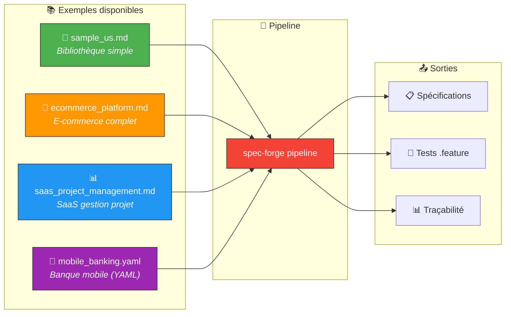

# 📚 Examples — Exemples de User Stories

> Ce dossier contient des exemples de User Stories prêts à l'emploi
> pour tester et démontrer les capacités de spec-forge.

---

## 🏗️ Vue d'ensemble



---

## 📁 Fichiers

| Fichier | Format | Domaine | Complexité | User Stories |
|---------|--------|---------|------------|--------------|
| 📝 `user_stories/sample_us.md` | Markdown | 📖 Bibliothèque | ⭐ Simple | ~3 US |
| 🛒 `user_stories/ecommerce_platform.md` | Markdown | 🛍️ E-commerce | ⭐⭐⭐ Complexe | ~10+ US |
| 📊 `user_stories/saas_project_management.md` | Markdown | 📋 Gestion projet | ⭐⭐⭐ Complexe | ~10+ US |
| 🏦 `user_stories/mobile_banking.yaml` | YAML | 🏦 Banque mobile | ⭐⭐ Moyen | ~8 US |

---

## 🚀 Utilisation

### ⚡ Pipeline complet sur un exemple

```bash
# 📝 Exemple simple (bibliothèque)
cargo run -- pipeline -i examples/user_stories/sample_us.md -o output/

# 🛒 Exemple complexe (e-commerce)
cargo run -- pipeline -i examples/user_stories/ecommerce_platform.md -o output/

# 🏦 Exemple YAML (banque mobile)
cargo run -- pipeline -i examples/user_stories/mobile_banking.yaml -o output/
```

### 🔧 Raffinement seul

```bash
cargo run -- refine -i examples/user_stories/sample_us.md -o output/specs/
```

---

## 📝 Format Markdown attendu

```markdown
# User Stories - Mon Projet

## Titre de la US

En tant que [acteur], je veux [action]
afin de [bénéfice].

- Critère d'acceptation 1
- Critère d'acceptation 2
```

## 📄 Format YAML attendu

```yaml
project: Mon Projet
user_stories:
  - title: Titre de la US
    actor: acteur
    action: action souhaitée
    benefit: bénéfice attendu
    priority: P1
    acceptance_criteria:
      - Critère d'acceptation 1
      - Critère d'acceptation 2
```

---

## 🌍 Multi-langue

| Langue | Détection | Format Gherkin |
|--------|-----------|----------------|
| 🇫🇷 Français | `"En tant que..."` | Soit / Quand / Alors |
| 🇬🇧 Anglais | `"As a..."` | Given / When / Then |
