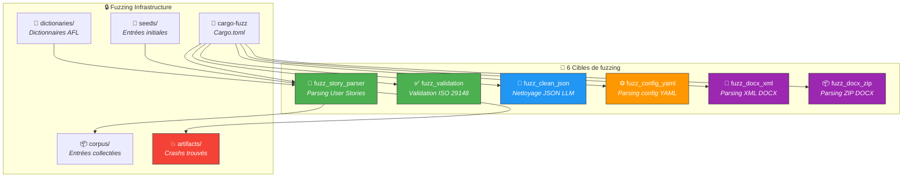

# 🔒 Fuzzing — Tests de robustesse (cargo-fuzz)

> Le fuzzing envoie des entrées aléatoires/mutées aux parseurs et validateurs
> pour détecter les panics, les boucles infinies et les vulnérabilités.

---

## 🏗️ Vue d'ensemble



---

## 🎯 Cibles de fuzzing

| Cible | Fichier | Ce qu'elle teste |
|-------|---------|-----------------|
| 📝 `fuzz_story_parser` | `fuzz_targets/fuzz_story_parser.rs` | Parsing de User Stories avec entrées arbitraires |
| ✅ `fuzz_validation` | `fuzz_targets/fuzz_validation.rs` | Validation ISO 29148 avec spécifications aléatoires |
| 🔧 `fuzz_clean_json` | `fuzz_targets/fuzz_clean_json.rs` | Nettoyage JSON depuis réponses LLM brutes |
| ⚙️ `fuzz_config_yaml` | `fuzz_targets/fuzz_config_yaml.rs` | Parsing de configurations YAML invalides |
| 📄 `fuzz_docx_xml` | `fuzz_targets/fuzz_docx_xml.rs` | Parsing XML extrait de fichiers DOCX |
| 📦 `fuzz_docx_zip` | `fuzz_targets/fuzz_docx_zip.rs` | Ouverture de fichiers ZIP (DOCX) arbitraires |

---

## 📁 Structure

```
fuzz/
├── 📄 Cargo.toml              # Dépendances fuzzing (libfuzzer-sys)
├── 🎯 fuzz_targets/
│   ├── fuzz_story_parser.rs   # 📝 Parseur User Stories
│   ├── fuzz_validation.rs     # ✅ Validation ISO
│   ├── fuzz_clean_json.rs     # 🔧 Nettoyage JSON
│   ├── fuzz_config_yaml.rs    # ⚙️ Config YAML
│   ├── fuzz_docx_xml.rs       # 📄 XML DOCX
│   └── fuzz_docx_zip.rs       # 📦 ZIP DOCX
├── 🌱 seeds/
│   └── story_parser/
│       ├── sample_fr.md       # 🇫🇷 Seed français
│       └── sample_en.md       # 🇬🇧 Seed anglais
├── 📖 dictionaries/           # Dictionnaires de tokens
├── 📦 corpus/                 # Entrées collectées (auto-généré)
└── 💥 artifacts/              # Crashs découverts (auto-généré)
```

---

## 🚀 Commandes

```bash
# 🔒 Lancer le fuzzing sur une cible (tourne en continu)
cargo fuzz run fuzz_story_parser

# ⏱️ Limiter la durée (60 secondes)
cargo fuzz run fuzz_story_parser -- -max_total_time=60

# 📊 Lister les cibles disponibles
cargo fuzz list

# 💥 Reproduire un crash
cargo fuzz run fuzz_story_parser artifacts/fuzz_story_parser/crash-xxx

# 📈 Rapport de couverture
cargo fuzz coverage fuzz_story_parser
```

---

## ➕ Ajouter une nouvelle cible

1. Créer `fuzz/fuzz_targets/fuzz_mon_parseur.rs` :

```rust
#![no_main]
use libfuzzer_sys::fuzz_target;

fuzz_target!(|data: &[u8]| {
    if let Ok(s) = std::str::from_utf8(data) {
        let _ = spec_forge::mon_module::parse(s);
    }
});
```

2. Ajouter dans `fuzz/Cargo.toml` :

```toml
[[bin]]
name = "fuzz_mon_parseur"
path = "fuzz_targets/fuzz_mon_parseur.rs"
test = false
doc = false
```

3. (Optionnel) Ajouter des seeds dans `fuzz/seeds/mon_parseur/`
