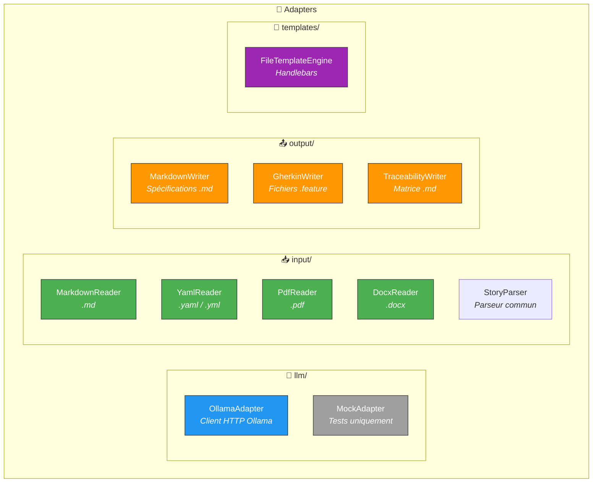
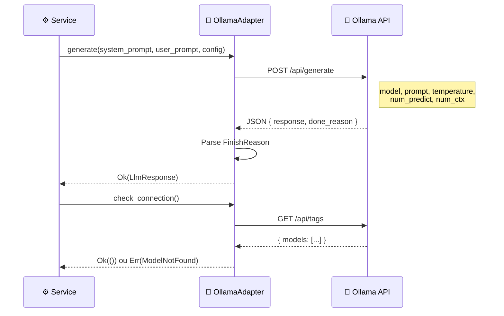
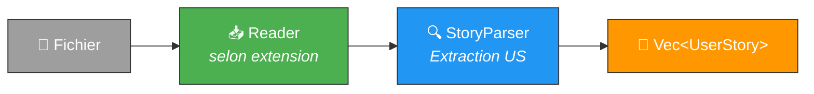

# 🔧 Adapters — Implémentations concrètes

> Les **adapters** implémentent les ports (traits) définis dans `ports/`.
> Ils gèrent toute l'I/O : réseau, fichiers, templates.

---

## 🏗️ Vue d'ensemble



---

## 📁 Structure

```
adapters/
├── 🧠 llm/
│   ├── ollama_adapter.rs    # Client HTTP reqwest → Ollama API
│   └── mock_adapter.rs      # Mock pour tests (réponses pré-définies)
├── 📥 input/
│   ├── markdown_reader.rs   # Parse User Stories depuis Markdown
│   ├── yaml_reader.rs       # Parse User Stories depuis YAML
│   ├── pdf_reader.rs        # Parse User Stories depuis PDF
│   ├── docx_reader.rs       # Parse User Stories depuis DOCX
│   ├── story_parser.rs      # Parseur commun (format "En tant que...")
│   └── mod.rs               # MAX_INPUT_FILE_SIZE = 10 Mo
├── 📤 output/
│   ├── markdown_writer.rs   # Écrit les spécifications en Markdown
│   ├── gherkin_writer.rs    # Écrit les fichiers .feature (FR/EN)
│   ├── traceability_writer.rs # Écrit la matrice de traçabilité
│   └── snapshots/           # Snapshots insta pour tests
└── 📝 templates/
    └── file_template_engine.rs # Charge et rend les templates Handlebars
```

---

## 🧠 LLM Adapter — OllamaAdapter



### ⚙️ Configuration

| Paramètre | Défaut | Description |
|-----------|--------|-------------|
| `model_name` | `qwen2.5:7b` | Modèle Ollama |
| `temperature` | `0.1` | Créativité (0.0 = déterministe) |
| `max_tokens` | `4096` | Tokens maximum en sortie |
| `context_size` | `8192` | Fenêtre de contexte |
| `api_base_url` | `http://localhost:11434` | URL de l'API Ollama |

---

## 📥 Input Adapters — Formats supportés

| Adapter | Format | Extension | Crate |
|---------|--------|-----------|-------|
| `MarkdownReader` | Markdown | `.md` | `pulldown-cmark` |
| `YamlReader` | YAML | `.yaml` / `.yml` | `serde_yaml` |
| `PdfReader` | PDF | `.pdf` | `pdf-extract` |
| `DocxReader` | DOCX | `.docx` | `zip` + XML parsing |

> 📏 **Limite** : 10 Mo par fichier (`MAX_INPUT_FILE_SIZE`)

### 🔄 Flux de parsing



---

## 📤 Output Adapters — Artefacts générés

| Adapter | Sortie | Contenu |
|---------|--------|---------|
| `MarkdownWriter` | `spec-*.md` | Spécification complète (FR, scénarios, entités, ...) |
| `GherkinWriter` | `*.feature` | Fichiers BDD avec tags `@US-xxx @FR-xxx` |
| `TraceabilityWriter` | `traceability.md` | Matrice FR → US → Scénarios + métriques |

---

## ➕ Ajouter un nouvel adapter

1. Créer `src/adapters/<groupe>/mon_adapter.rs`
2. Implémenter le trait du port correspondant
3. Ajouter `pub mod mon_adapter;` dans le `mod.rs` du groupe
4. Injecter via `Arc<dyn Trait>` dans l'application
5. Ajouter des tests unitaires inline

> 💡 **Astuce** : utiliser le skill `/add-adapter` pour le scaffolding automatique
