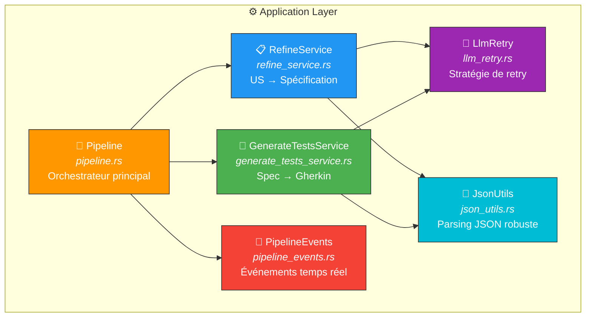
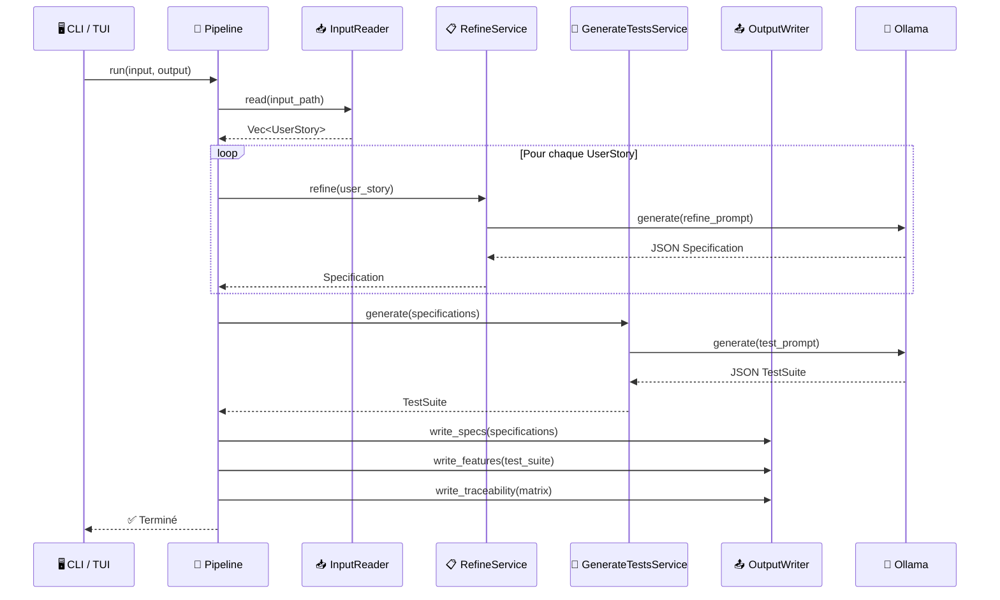

# ⚙️ Application — Orchestration du pipeline

> La couche **application** orchestre les cas d'usage en combinant les ports et le domaine.
> Elle gère le retry LLM, le parsing JSON, et les événements du pipeline.

---

## 🏗️ Vue d'ensemble

---

## 📁 Fichiers

| Fichier | Rôle | Taille |
|---------|------|--------|
| 🔄 `pipeline.rs` | Orchestrateur : lecture → raffinement → génération → écriture | ~13 Ko |
| 📋 `refine_service.rs` | Raffinement US → Spécification via LLM + parsing JSON | ~56 Ko |
| 🧪 `generate_tests_service.rs` | Génération Spec → Gherkin/BDD via LLM + parsing JSON | ~45 Ko |
| 🔁 `llm_retry.rs` | Retry exponentiel avec backoff configurable | ~6 Ko |
| 🔧 `json_utils.rs` | Nettoyage et extraction JSON depuis les réponses LLM | ~7 Ko |
| 📡 `pipeline_events.rs` | Types `PipelineStage` et `PipelineEvent` pour le suivi | ~2 Ko |

---

## 🔄 Pipeline — Flux complet

---

## 📋 RefineService — US → Spécification

Le service de raffinement transforme chaque User Story en une spécification conforme ISO 29148 :

---

## 🧪 GenerateTestsService — Spec → Gherkin

Le service de génération produit des tests BDD conformes ISO 29119 :

---

## 🔁 Stratégie de retry LLM

| Paramètre | Valeur | Description |
|-----------|--------|-------------|
| `max_retries` | 3 (config) | Nombre maximum de tentatives |
| Backoff | Exponentiel | Délai croissant entre les tentatives |
| Retry sur | `OutputTruncated`, `OutputParseFailed` | Erreurs récupérables |
| Pas de retry | `ConnectionFailed`, `ModelNotFound` | Erreurs fatales |

---

## 📡 Événements du pipeline

Les événements permettent le suivi en temps réel (TUI et CLI) :

| Stage | Description |
|-------|-------------|
| `Reading` | 📥 Lecture des entrées |
| `Refining` | 📋 Raffinement en cours |
| `Generating` | 🧪 Génération des tests |
| `Writing` | 📤 Écriture des sorties |
| `Completed` | ✅ Pipeline terminé |
| `Failed` | ❌ Erreur survenue |
