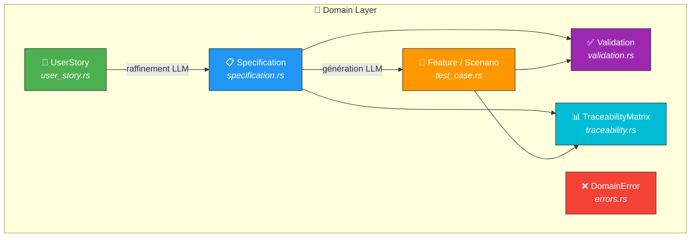
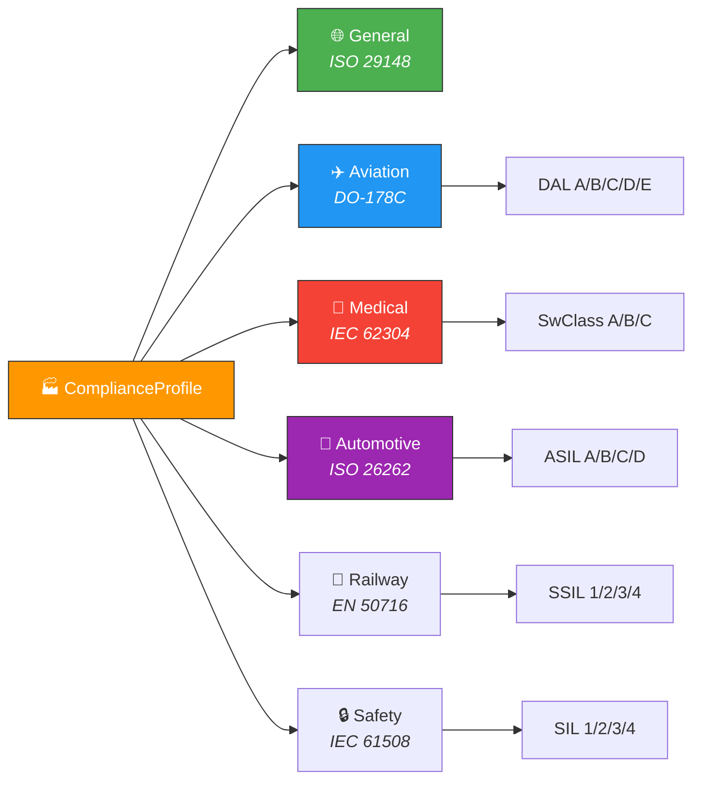
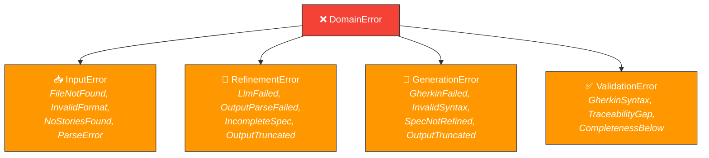

# 🎯 Domain — Logique métier pure

> Cœur du système spec-forge. **Aucune dépendance externe** (pas d'I/O, pas de réseau, pas de framework).
> Seules les crates `serde`, `thiserror`, `uuid` et `chrono` sont autorisées.

---

## 🏗️ Vue d'ensemble



---

## 📁 Fichiers

| Fichier | Rôle | Norme ISO |
|---------|------|-----------|
| 📝 `user_story.rs` | Modèle `UserStory`, `Priority` (MoSCoW P1/P2/P3), `Language` (FR/EN) | — |
| 📋 `specification.rs` | `Specification`, `FunctionalRequirement`, `QualityCharacteristic`, `ComplianceProfile` | ISO 29148, ISO 25010 |
| 🧪 `test_case.rs` | `Feature`, `Scenario`, `Step`, `TestLevel`, `CoverageTechnique` | ISO 29119 |
| ✅ `validation.rs` | 9 critères de bien-formation, mots ambigus interdits, métriques de couverture | ISO 29148, ISO 25023 |
| 📊 `traceability.rs` | `TraceabilityMatrix`, `TraceabilityEntry`, `ComplianceNote` | ISO 29148 §6.6 |
| ❌ `errors.rs` | `DomainError`, `InputError`, `RefinementError`, `GenerationError`, `ValidationError` | — |

---

## 📐 Normes ISO implémentées

### 📋 ISO/IEC/IEEE 29148:2018 — Ingénierie des exigences

9 critères de bien-formation dans `validation.rs` :

```
✅ Necessary    — Pas de doublon
🎯 Unambiguous  — Pas de mots ambigus (environ, parfois, ...)
📝 Complete     — Tous les champs remplis
1️⃣ Singular     — Une exigence par statement
🏗️ Feasible     — Réalisable
🔬 Verifiable   — Testable
✏️ Correct      — Mots normatifs (MUST/SHALL/SHOULD/COULD)
📏 Conforming   — Format conforme
🔗 Traceable    — Source identifiable
```

### ⭐ ISO/IEC 25010:2023 — Qualité produit

9 caractéristiques dans `specification.rs` → `QualityCharacteristic` :

| Caractéristique | Description |
|----------------|-------------|
| `FunctionalSuitability` | Adéquation fonctionnelle |
| `PerformanceEfficiency` | Efficacité performance |
| `Compatibility` | Compatibilité |
| `InteractionCapability` | Capacité d'interaction |
| `Reliability` | Fiabilité |
| `Security` | Sécurité |
| `Maintainability` | Maintenabilité |
| `Flexibility` | Flexibilité |
| `Safety` | Sûreté |

### 🧪 ISO/IEC/IEEE 29119 — Tests logiciel

Niveaux de test (`TestLevel`) : `Unit` | `Integration` | `System` | `Acceptance`

Techniques de couverture (`CoverageTechnique`) :

| Code | Technique |
|------|-----------|
| `EP` | Equivalence Partitioning |
| `BVA` | Boundary Value Analysis |
| `DT` | Decision Table |
| `ST` | State Transition |
| `EG` | Error Guessing |

---

## 🏭 Profils de conformité réglementaire



---

## 🔒 Hiérarchie des erreurs



---

## 🧪 Tests

Chaque fichier du domaine contient ses tests unitaires inline `#[cfg(test)]`.

```bash
# Lancer uniquement les tests du domaine
cargo test domain::
```
