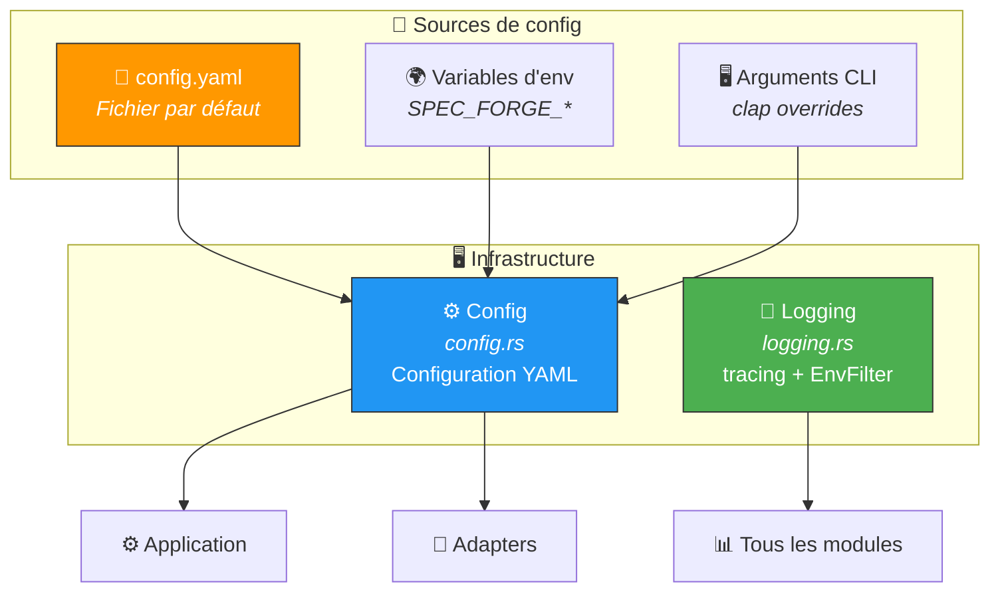
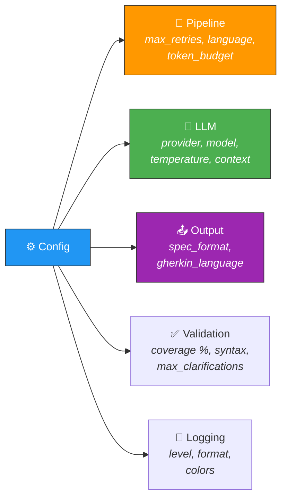

# 🖥️ Infrastructure — Configuration & Logging

> La couche **infrastructure** gère la configuration YAML hiérarchique et le logging structuré.
> Elle fournit les paramètres à toutes les autres couches.

---

## 🏗️ Vue d'ensemble



---

## 📁 Fichiers

| Fichier | Rôle | Taille |
|---------|------|--------|
| ⚙️ `config.rs` | Chargement et validation de la configuration YAML | ~17 Ko |
| 📜 `logging.rs` | Initialisation de `tracing` avec filtre par niveau | ~1 Ko |

---

## ⚙️ Configuration — Sections



### 📋 Paramètres clés

| Section | Paramètre | Défaut | Description |
|---------|-----------|--------|-------------|
| `llm` | `provider` | `ollama` | Provider LLM |
| `llm` | `model_name` | `qwen2.5:7b` | Modèle à utiliser |
| `llm` | `temperature` | `0.1` | Créativité (0.0–1.0) |
| `llm` | `context_size` | `8192` | Fenêtre de contexte (tokens) |
| `pipeline` | `max_retries` | `3` | Tentatives max par appel LLM |
| `pipeline` | `default_language` | `fr` | Langue par défaut |
| `output` | `gherkin_language` | `fr` | Mots-clés Gherkin (fr/en) |
| `validation` | `min_coverage_percent` | `80` | Couverture minimale exigée |
| `logging` | `level` | `info` | Niveau de log |

---

## 📜 Logging — tracing

Le système utilise `tracing` avec `EnvFilter` pour un logging structuré :

```bash
# Ajuster le niveau de log
RUST_LOG=debug cargo run -- pipeline -i input.md -o output/

# Niveaux disponibles : error, warn, info, debug, trace
```
