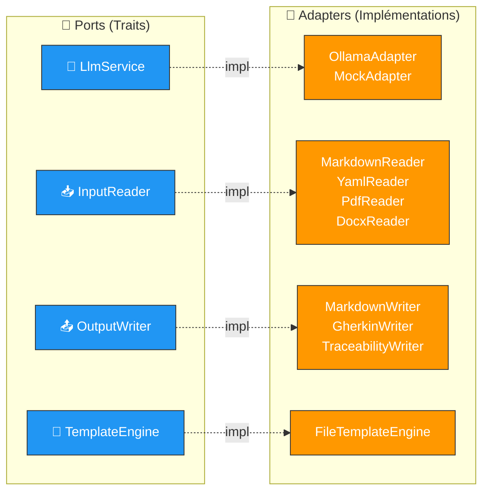
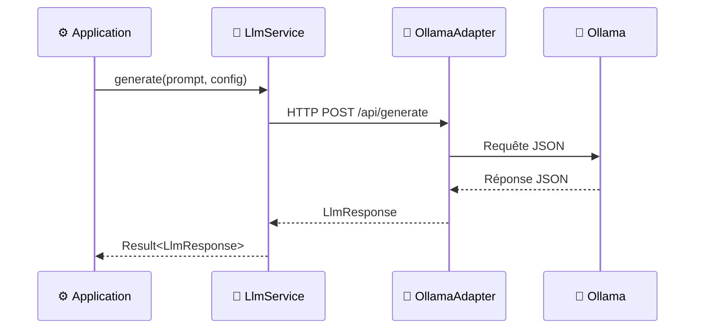

# 🔌 Ports — Interfaces abstraites

> Les **ports** définissent les contrats (traits) entre le domaine/application et le monde extérieur.
> Chaque port est un trait Rust avec `#[async_trait]` + `Send + Sync`.

---

## 🏗️ Vue d'ensemble



---

## 📁 Fichiers

| Fichier | Trait | Responsabilité |
|---------|-------|----------------|
| 🧠 `llm_service.rs` | `LlmService` | Communication avec le LLM (generate, check_connection) |
| 📥 `input_reader.rs` | `InputReader` | Lecture des User Stories depuis un fichier |
| 📤 `output_writer.rs` | `OutputWriter` | Écriture des artefacts générés |
| 📝 `template_engine.rs` | `TemplateEngine` | Chargement et rendu des templates de prompts |

---

## 🧠 LlmService — Le port principal



### 📦 Types associés

| Type | Description |
|------|-------------|
| `LlmConfig` | Configuration (model, temperature, max_tokens, context_size) |
| `LlmResponse` | Réponse LLM (response, model, finish_reason) |
| `FinishReason` | Raison d'arrêt (Stop, Length, Error) |
| `LlmError` | Erreurs LLM (ConnectionFailed, ModelNotFound, GenerationFailed) |

---

## 🔑 Principe d'injection de dépendances

```rust
// ✅ Injection via Arc<dyn Trait>
let llm: Arc<dyn LlmService> = Arc::new(OllamaAdapter::new(config));
let pipeline = Pipeline::new(llm, reader, writer, template_engine);
```

> 💡 **Avantage** : les tests utilisent `MockAdapter` sans modifier le code applicatif.

---

## ➕ Ajouter un nouveau port

1. Créer `src/ports/mon_port.rs` avec un trait `#[async_trait]`
2. Ajouter `pub mod mon_port;` dans `src/ports/mod.rs`
3. Créer l'adapter correspondant dans `src/adapters/`
4. Injecter via `Arc<dyn MonPort>` dans l'application
