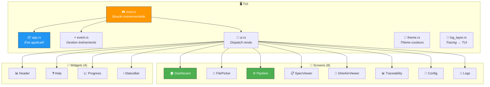
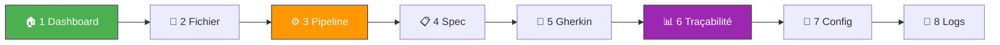
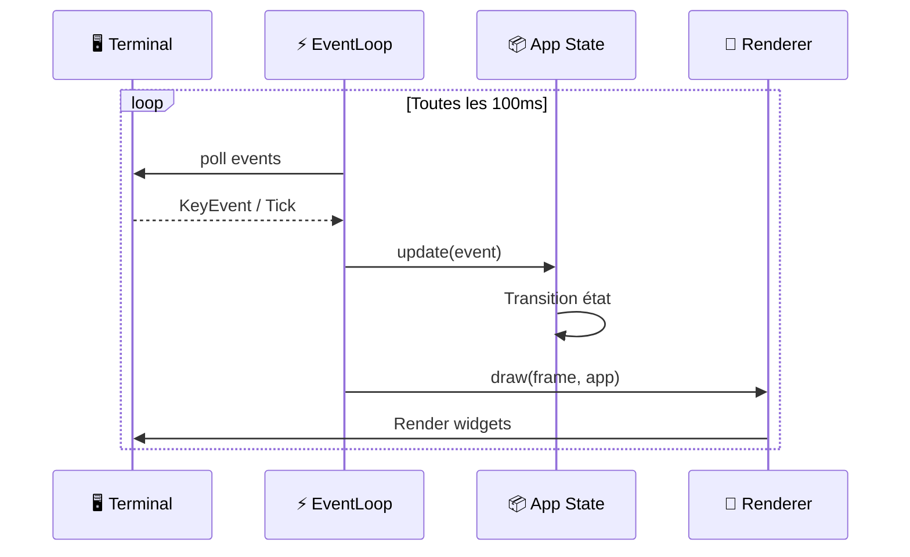

# 🖥️ TUI — Interface Terminal Interactive

> L'interface TUI offre une expérience interactive complète pour piloter spec-forge
> directement depuis le terminal, construite avec **ratatui** + **crossterm**.

---

## 🏗️ Vue d'ensemble



---

## 📱 Écrans



| # | Touche | Écran | Description |
|---|--------|-------|-------------|
| 1 | `1` | 🏠 Dashboard | Accueil, statut LLM, résumé projet |
| 2 | `2` | 📂 FilePicker | Navigation et sélection de fichiers |
| 3 | `3` | ⚙️ Pipeline | Lancement et suivi en temps réel |
| 4 | `4` | 📋 SpecViewer | Visualisation spécification raffinée |
| 5 | `5` | 🧪 GherkinViewer | Visualisation tests Gherkin générés |
| 6 | `6` | 📊 Traceability | Matrice de traçabilité interactive |
| 7 | `7` | 🔧 Config | Configuration actuelle |
| 8 | `8` | 📜 Logs | Journaux en temps réel |

### ⌨️ Raccourcis clavier

| Touche | Action |
|--------|--------|
| `1`–`8` | Naviguer vers un écran |
| `q` / `Ctrl+C` | Quitter |
| `Esc` | Annuler pipeline en cours |
| `↑` `↓` | Défiler dans les listes |
| `Enter` | Confirmer/sélectionner |

---

## 📁 Structure

```
tui/
├── 🎮 mod.rs          # Boucle principale, setup terminal
├── 📦 app.rs          # App state (Screen, PipelineStatus, LlmStatus)
├── ⚡ event.rs        # Polling événements clavier/tick
├── 🎨 ui.rs           # Dispatch du rendu par écran
├── 🎨 theme.rs        # Palette de couleurs
├── 📜 log_layer.rs    # Layer tracing → buffer circulaire
├── 📱 screens/
│   ├── dashboard.rs       # 🏠 Accueil
│   ├── file_picker.rs     # 📂 Sélecteur fichiers
│   ├── pipeline.rs        # ⚙️ Pipeline
│   ├── spec_viewer.rs     # 📋 Spécification
│   ├── gherkin_viewer.rs  # 🧪 Gherkin
│   ├── traceability.rs    # 📊 Traçabilité
│   ├── config.rs          # 🔧 Configuration
│   └── logs.rs            # 📜 Journaux
└── 🧩 widgets/
    ├── header.rs      # Barre de titre avec onglets
    ├── help.rs        # Aide contextuelle
    ├── progress.rs    # Barre de progression pipeline
    └── status_bar.rs  # Barre de statut en bas
```

---

## 🔄 Boucle événementielle



---

## 🚀 Lancement

```bash
spec-forge tui
```
