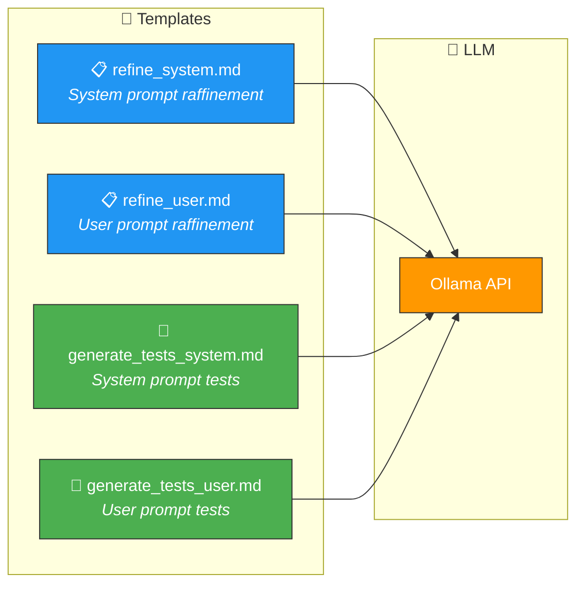

# 📝 Templates — Prompts LLM (Handlebars)

> Les templates définissent les prompts envoyés au LLM (Ollama) pour le raffinement
> et la génération de tests. Ils utilisent la syntaxe **Handlebars**.

---

## 🏗️ Vue d'ensemble

---

## 📁 Fichiers

| Fichier | Rôle | Utilisé par |
|---------|------|-------------|
| 📋 `refine_system.md` | Prompt système pour le raffinement (ISO 29148/25010) | `RefineService` |
| 📋 `refine_user.md` | Prompt utilisateur avec les données de la User Story | `RefineService` |
| 🧪 `generate_tests_system.md` | Prompt système pour la génération de tests (ISO 29119) | `GenerateTestsService` |
| 🧪 `generate_tests_user.md` | Prompt utilisateur avec les données de la spécification | `GenerateTestsService` |

---

## 🔧 Variables Handlebars

### 📋 Raffinement (`refine_user.md`)

| Variable | Type | Description |
|----------|------|-------------|
| `{{title}}` | String | Titre de la User Story |
| `{{actor}}` | String | Acteur ("bibliothécaire", "user") |
| `{{action}}` | String | Action souhaitée |
| `{{benefit}}` | String | Bénéfice attendu |
| `{{acceptance_criteria}}` | String | Critères d'acceptation |
| `{{language}}` | String | Langue (`fr` ou `en`) |

### 🧪 Génération de tests (`generate_tests_user.md`)

| Variable | Type | Description |
|----------|------|-------------|
| `{{spec_json}}` | JSON | Spécification complète sérialisée |
| `{{language}}` | String | Langue cible pour le Gherkin |
| `{{requirements_count}}` | Number | Nombre d'exigences fonctionnelles |

---

## 📐 Contenu des templates

### 📋 `refine_system.md` — Directives ISO

Le system prompt inclut :
- 📐 Références aux normes ISO 29148 et 25010
- 📦 Schéma JSON attendu en sortie (Specification)
- ✅ Règles de validation des exigences
- 🏷️ Convention de nommage des FR (FR-001, FR-002, ...)
- 🔒 Mots normatifs obligatoires (MUST, SHALL, SHOULD, COULD)

### 🧪 `generate_tests_system.md` — Directives BDD

Le system prompt inclut :
- 🧪 Références ISO 29119-3/4
- 📄 Format Gherkin attendu (Feature, Scenario, Given/When/Then)
- 🏷️ Tags de traçabilité (`@US-xxx`, `@FR-xxx`, `@happy_path`)
- 📊 Techniques de couverture (EP, BVA, DT, ST, EG)
- 🔗 Couverture obligatoire de chaque FR

---

## ⚠️ Règles de modification

1. **Toujours valider** que le schéma JSON de sortie correspond aux structs Rust dans `domain/`
2. **Tester** après modification avec un pipeline complet
3. **Ne pas supprimer** les directives ISO — elles garantissent la qualité
4. Les variables `{{...}}` sont injectées par `FileTemplateEngine` (Handlebars)
