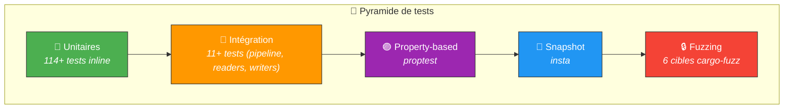

# 🧪 Tests — Stratégie de test complète

> spec-forge utilise une stratégie de test multi-couches : tests unitaires, intégration,
> property-based, snapshot et fuzzing. **125+ tests** au total.

---

## 🏗️ Pyramide de tests



---

## 📁 Structure

```
tests/
├── 📄 integration.rs           # Module racine des tests d'intégration
├── 🔸 integration/
│   ├── test_pipeline.rs        # Tests du pipeline complet (mock LLM)
│   ├── test_readers.rs         # Tests des readers (MD, YAML)
│   └── test_writers.rs         # Tests des writers (Markdown, Gherkin, Traçabilité)
└── 📦 fixtures/
    ├── sample_us_en.md         # 🇬🇧 User Story anglaise de test
    ├── sample_us_fr.md         # 🇫🇷 User Story française de test
    ├── sample_us.yaml          # 📄 User Story YAML de test
    ├── mock_refine_response.json    # 🤖 Réponse LLM simulée (raffinement)
    └── mock_generate_response.json  # 🤖 Réponse LLM simulée (génération)
```

---

## 🛠️ Types de tests

### 🔹 Tests unitaires (114+)

Chaque module du domaine contient ses tests inline `#[cfg(test)]` :

| Module | Fichier | Tests |
|--------|---------|-------|
| 🎯 Domain | `specification.rs` | Enums, Display, sérialization |
| 🎯 Domain | `validation.rs` | 9 critères ISO 29148, métriques |
| 🎯 Domain | `test_case.rs` | Feature, Scenario, Step |
| 🎯 Domain | `traceability.rs` | Matrice, couverture, GAPs |
| 🎯 Domain | `user_story.rs` | Priority, Language |
| 🎯 Domain | `errors.rs` | Display, From conversions |
| 🔧 Adapters | `story_parser.rs` | Parsing US (FR/EN) |
| ⚙️ Application | `refine_service.rs` | Parsing JSON, retry |
| ⚙️ Application | `generate_tests_service.rs` | Parsing JSON, validation |
| ⚙️ Application | `json_utils.rs` | Nettoyage JSON |

### 🔸 Tests d'intégration (11+)

| Fichier | Scénario |
|---------|----------|
| `test_pipeline.rs` | Pipeline complet avec MockAdapter |
| `test_readers.rs` | Lecture MD, YAML depuis fixtures |
| `test_writers.rs` | Écriture specs, features, traçabilité en tmpdir |

### 🟣 Property-based testing (proptest)

Génération aléatoire d'entrées pour tester les invariants :
- Parsing de User Stories avec entrées arbitraires
- Validation avec spécifications aléatoires
- Sérialisation/désérialisation round-trip

### 📸 Snapshot testing (insta)

Snapshots dans `src/adapters/output/snapshots/` pour vérifier que :
- Le format Markdown généré est stable
- Le format Gherkin est syntaxiquement correct
- La matrice de traçabilité conserve sa structure

### 🌐 Mock HTTP (wiremock)

Simulation du serveur Ollama pour les tests d'intégration LLM :
- Réponses pré-enregistrées dans `fixtures/`
- Vérification des requêtes HTTP (model, prompt, temperature)

---

## 🚀 Commandes

```bash
# 🧪 Tous les tests
cargo test

# 🔹 Tests unitaires uniquement (domaine)
cargo test domain::

# 🔸 Tests d'intégration uniquement
cargo test --test integration

# 📸 Mettre à jour les snapshots
cargo insta review

# 🟣 Property-based (inclus dans cargo test)
cargo test proptest

# 🔒 Fuzzing (voir fuzz/README.md)
cargo fuzz run fuzz_story_parser
```

---

## ➕ Ajouter un nouveau test

### Test unitaire
Ajouter un bloc `#[cfg(test)]` dans le fichier source concerné.

### Test d'intégration
1. Créer `tests/integration/test_mon_module.rs`
2. Ajouter `mod test_mon_module;` dans `tests/integration.rs`
3. Utiliser les fixtures existantes ou en créer de nouvelles dans `tests/fixtures/`
